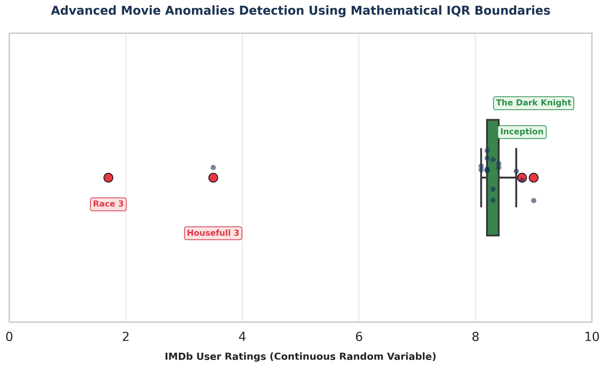

# 🎬 Movie Ratings Outlier & Skewness Detection 🚀

An end-to-end Data Science project to analyze IMDb movie ratings, detect statistical anomalies using the Interquartile Range (IQR) method, and understand data distributions.

## 📊 Visual Output
Here is the final advanced distribution plot generated by the project:

## 🎯 Key Takeaways & Core Concepts Learned

### 1. Position Measures (Percentiles & Quartiles)
* Understood how data splits into 4 quarters ($Q_1$, $Q_2$/Median, $Q_3$).
* Used the *Five-Number Summary* to analyze the boundaries of movie datasets.

### 2. Shape of Data (Left-Skewed Distribution)
* Discovered that the movie rating dataset is *Negatively Skewed (Left-Skewed)* because the majority of high-quality movies are clustered around 8.0-8.5 (Right side), while a few flops stretch the tail to the left.
* *Mathematical Proof:* $\text{Mean} < \text{Median} < \text{Mode}$. Extreme flops like Race 3 (1.9) and Housefull 4 (3.5) corrupted the Mean, making the *Median* a better metric for analysis.

### 3. Random Variables & Probability Distributions
* Dealt with *Continuous Random Variables* (Ratings can take any decimal value like 8.2, 1.9).
* Mapped individual data density using a Jitter Plot (sns.stripplot) overlay on top of the Box Plot.

### 4. Mathematical Outlier Detection (IQR Method)
Instead of hardcoding, used the industry-standard statistical boundaries:
* $\text{IQR} = Q_3 - Q_1$
* $\text{Lower Bound} = Q_1 - (1.5 \times \text{IQR})$
* $\text{Upper Bound} = Q_3 + (1.5 \times \text{IQR})$

* *Negative Outliers Detected:* Race 3 and Housefull 4 (Fell below the lower bound).
* *Positive Outliers Detected:* The Dark Knight and Inception (Exceeded the upper bound due to exceptionally high ratings compared to the normal cluster).

## 🛠️ Tech Stack Used
* *Language:* Python 3
* *Libraries:* Pandas, Matplotlib, Seaborn
* *Environment:* Google Colab
*
